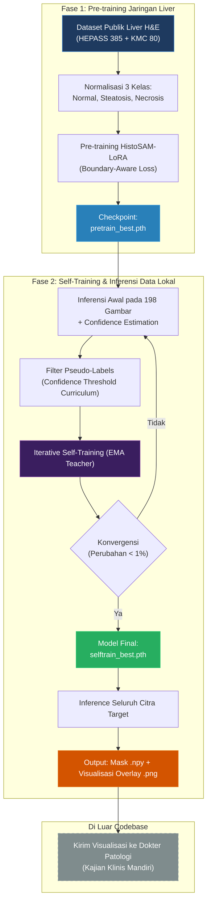

# Rencana Penelitian: HistoSAM-LoRA untuk Histopatologi Hepar

## 1. Ringkasan Eksekutif

- **Subjek**: Histopatologi hepar tikus (H&E staining) dengan 198 citra TIFF mikroskopis.
- **Kondisi Awal**: Data belum memiliki label awal (*zero-shot/unlabeled target domain*). Evaluasi akhir oleh dokter patologi dilakukan secara terpisah di luar codebase setelah pipeline segmentasi selesai menghasilkan inferensi dan visualisasi.
- **Arsitektur Model**: HistoSAM-LoRA (MedSAM ViT-B Frozen Encoder + LoRA rank-16 adaptasi + CARAFE Decoder resolusi tinggi).
- **Baseline Pembanding**: U-Net Standard (`baselines/unet_baseline.py`) untuk perbandingan empiris di paper.
- **Fokus Magnifikasi**: **20x** (rekomendasi terbaik standar WHO histopatologi liver untuk steatosis, nekrosis, dan parenkim hepar), dengan dukungan pemrosesan fleksibel.

---

## 2. Diagram Alur Penelitian (2 Fase)



---

## 3. Rincian Fase 1: Pre-training pada Dataset Publik

1. **Dataset Publik**:
   - **HEPASS Dataset** (Salvi et al., Computers in Biology and Medicine, 2020): 385 citra liver H&E dengan ground-truth steatosis mikro/makrovesikuler.
   - **KMC Liver Dataset**: 80 citra histopatologi liver teranotasi multi-kelas.
2. **Standardisasi Label ke 3-Class Taxonomy**:
   - Kelas 0: Background & Normal Hepatic Parenchyma
   - Kelas 1: Steatosis (vakuola lipid intraseluler)
   - Kelas 2: Necrosis / Inflammatory Infiltration
3. **Loss Function**: `BoundaryAwareJointLoss` (Focal Loss + Dice Loss + Laplacian Boundary Loss).

---

## 4. Rincian Fase 2: Iterative Self-Training pada 198 Citra Hepar

1. **Pseudo-Labeling dengan Confidence Masking**:
   - Model pre-trained mengestimasi probabilitas softmax per piksel.
   - Hanya piksel dengan confidence $p > \tau$ (curriculum: $\tau$ mulai dari 0.95 diturunkan bertahap ke 0.80) yang dilibatkan dalam gradien backpropagation.
2. **EMA Teacher Stabilization**:
   - Model Teacher diperbarui secara halus via Exponential Moving Average ($\alpha = 0.99$) untuk mencegah *confirmation bias* dan *label drifting*.
3. **Konvergensi Iteratif**:
   - Loop self-training otomatis berhenti ketika perubahan pseudo-label antar-ronde $< 1\%$.
4. **Hasil Akhir Pipeline**:
   - File mask klasifikasi biner/multi-kelas `.npy` di `results/predictions/`.
   - Visualisasi overlay kontur dan warna transparan per kelas `.png` di `results/visualizations/` resolusi tinggi untuk diserahkan ke dokter patologi.

---

## 5. Struktur Direktori Proyek

```
Histopatologi/
├── baselines/
│   └── unet_baseline.py             # Baseline pembanding (dipertahankan)
├── data/
│   ├── liver_primary/
│   │   ├── raw_images/              # 198 citra .tif
│   │   ├── processed/               # Tiles 512x512
│   │   └── pseudo_labels/           # Output pseudo-labels
│   ├── public_pretrain/             # Dataset publik HEPASS & KMC
│   ├── preprocessing/
│   │   ├── tiling.py                # Pemotongan tile citra mikroskopis
│   │   └── download_public_data.py  # Utility download dataset publik
│   ├── dataset.py                   # PyTorch Dataset (Local 20x filter & Public)
│   └── splits/                      # Patient-stratified split indexes
├── docs/
│   └── rencana_penelitian.md        # Dokumen acuan riset ini
├── models/
│   ├── histo_sam_lora.py            # Arsitektur HistoSAM-LoRA (Frozen ViT + LoRA + CARAFE)
│   └── carafe_module.py             # Content-Aware ReAssembly of Features
├── training/
│   ├── losses.py                    # Boundary-Aware Loss & ConfidenceWeightedLoss
│   ├── train.py                     # Training engine
│   ├── train_all_folds.py           # K-Fold Cross Validation runner
│   ├── generate_pseudo_labels.py    # Generator pseudo-label + confidence map
│   └── self_training.py             # Engine iterative self-training
├── evaluation/
│   ├── metrics.py                   # Metrik mIoU, Dice, HD95, ASD
│   └── visualize_results.py         # Generator overlay visual untuk dokter
├── results/
│   ├── checkpoints/                 # Model weights (.pth)
│   ├── predictions/                 # Binary/multi-class mask (.npy)
│   └── visualizations/              # Visualisasi segmentasi (.png)
├── inference.py                     # Script inferensi sekali jalan untuk seluruh gambar
├── download_weights.py              # Download backbone MedSAM ViT-B
└── requirements.txt                 # Dependensi minimal tanpa konflik DLL
```
